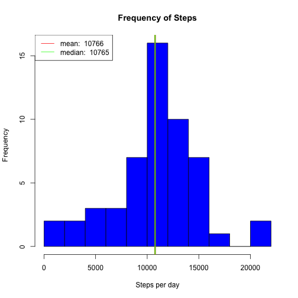
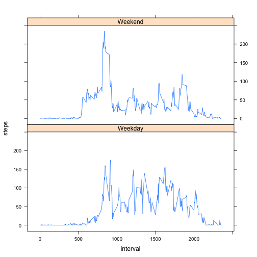

# Reproducible Research: Peer Assessment 1
## User: egrossman
Welcome! Here is my first project using RMarkdown.

I will be showing you how I analyze and transform data. For this specific data set, I am using data that is a result of how many steps a subject has taken. This data is taken in minute intervals across multiple days. Each row contains:

* The **date** this data was taken
* The Five minute **interval** that the number of steps were recorded
* The number of **steps** that were taken in this interval

## Loading and preprocessing the data
This section is pretty stright-forward. I've loaded the dataset into R using the read.csv command. I've also defined the classes of each column.


```r
activityData <- read.csv('activity.csv',colClasses=c('integer','Date','integer'))
```


## What is mean total number of steps taken per day?
In order to generate the number of steps per day, I had to first take the sum of the **steps** for each **date**. The aggregate function does this nicely.

```r
stepsPerDay<-aggregate(steps ~date ,activityData, sum)
```

The mean and median can then be calculated based on the result of the aggregate function.

```r
meanSteps <- as.integer(mean(stepsPerDay$steps))
medianSteps <- as.integer(median(stepsPerDay$steps))
```
Mean: 10766

Median: 10765

I've also  color coded the histogram as blue and made 10 break points for the frequency.


```r
hist(x=stepsPerDay[,"steps"],main='Frequency of Steps',xlab='Steps per day',col='BLUE',breaks=10)
abline(v=meanSteps,col='RED',lwd=3)
abline(v=medianSteps,col='GREEN',lwd=2)

legend('topleft',legend=c(paste('mean: ',meanSteps),paste('median: ',medianSteps)),lty=1,col=c('RED','GREEN'))
```

 

## What is the average daily activity pattern?

I use the aggregate function again to get the average number of steps for each interval.
I then calculate the interval at which the number of steps is the highest. 


```r
averageSteps<-aggregate(steps ~interval ,activityData, mean,na.rm=T)
## Get max value
maxSteps <- max(averageSteps$steps)
## Get interval associated with max
maxInterval<-averageSteps[which(averageSteps$steps == maxSteps),'interval']
```
Here, the maximum number of steps taken at a given interval was 206.1698 at the interval of 835 minutess

After plotting the data, I highlight this point on the graph

```r
## Plot data
with(data=averageSteps,plot(interval,steps,type='l',xlab='Intervals(minutes)'))
points(maxInterval,maxSteps,pch=16,col='RED',lwd=20)
text(x=maxInterval+220,y=maxSteps,labels=paste('Max Value    (',maxInterval,',',maxSteps,')'),cex=0.8)
```

 

## Imputing missing values


```r
nul<-is.na(activityData$steps)
totalNa<- length(nul[nul==TRUE])
```
The number of null values is 2304

Using the average values for intervals is a good idea because because most of the missing data has no values for the date they were taken. This will insure that the average does not change (adding the computed average to a list of values does not change the average). Plus, we've already computed the interval average :)


```r
filledData <- activityData
for (i in which(is.na(filledData$steps))){
  rowInt <- filledData$interval[i]
  dayAvg <- averageSteps[which(averageSteps$interval==rowInt),'steps']
  filledData$steps[i]<- dayAvg
  }
```

Now let's do our calculations again:


```r
stepsPerDay2<-aggregate(steps ~date ,filledData, sum)
meanSteps2 <- as.integer(mean(stepsPerDay2$steps))
medianSteps2 <- as.integer(median(stepsPerDay2$steps))
abline(v=meanSteps2,col='RED',lwd=3)
```

```
## Error: plot.new has not been called yet
```

```r
abline(v=medianSteps2,col='GREEN',lwd=2)
```

```
## Error: plot.new has not been called yet
```

Once again, we have the same mean of 10766 which is the same as before.
However, the median has changed. Before, the median was 10765 and now it is 10766. This changes because we've added steps unequally between what is above and below the median.

## Are there differences in activity patterns between weekdays and weekends?

First I added a new column to the data that labels the day as a weekend or weekday. I used the isWeekday function in the timeDate package to generate these values.

```
## Loading required package: timeDate
## Loading required package: lattice
```


```r
activityData$weekday <- factor(isWeekday(activityData$date),labels = c('Weekday',"Weekend"))
```

Then I subset the data so we have both weekends and weekdays:


```r
weekends <- subset(x=activityData,subset=activityData$weekday=='Weekend')
weekdays <- subset(x=activityData,subset=activityData$weekday=='Weekday')
averageWE<-aggregate(steps ~interval ,weekends, mean,na.rm=T)
averageWD<-aggregate(steps ~interval ,weekdays, mean,na.rm=T)
```

Now let's plot again:


```r
averageSteps3<-aggregate(steps ~ interval+ weekday ,activityData, mean,na.rm=T)
xyplot(steps ~ interval | weekday ,averageSteps3, type="l", layout=c(1,2))
```

 

